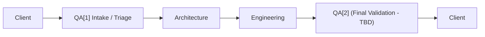
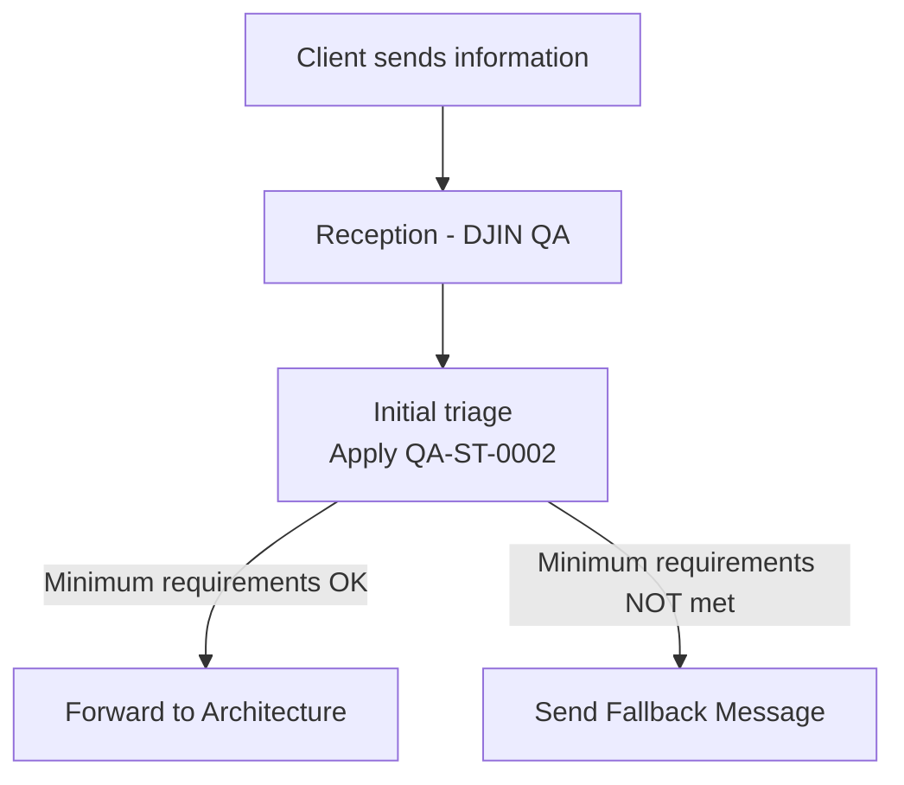

# 🔄 QA-P-0001 — End-to-End Quality Assurance Process

[← Back to Processes](../README.md)

---

## 📌 Objective

This process defines the complete Quality Assurance (QA) flow at DJIN, from initial client intake to final validation before delivery.

QA operates at **two critical points**:
- **QA[1]** — Intake triage (ensures minimum requirements)
- **QA[2]** — Final validation (ensures delivery quality) *(to be defined)*

---

## ✅ High-Level Flow

---

## 🧪 QA[1] — Initial Triage

### Objective

Ensure that **minimum necessary information** is present before forwarding to Architecture.

Prevents rework, bottlenecks, and time waste with incomplete or ambiguous requirements.

### Responsible

**DJIN Member (QA)** — Any DJIN Member assigned to the QA role executes this process.

### Flow

### Tools

* [**QA-ST-0002**](../../../standards/en/QA/QA-ST-0002.md) — QA Department Quality Standard (Operational Version)
* [**QA-ST-0002 Assistant**](TODO) — Initial Triage Assistant

---

## 🔍 QA[2] — Final Validation

### Objective

*(To be defined)*

Ensure the final product meets quality criteria before delivery to the client.

### Responsible

**DJIN Member (QA)** — Any DJIN Member assigned to the QA role executes this process.

### Flow

*(To be defined)*

---

## 🧠 Why This Process Works

Because:

* **Reduces waste** — avoids work without clear requirements
* **Increases velocity** — Architecture and Engineering receive quality input
* **Protects the client** — guarantees validated and reliable deliveries
* **Creates predictability** — each stage knows what to expect

---

**[← Back to Processes](../README.md)**
