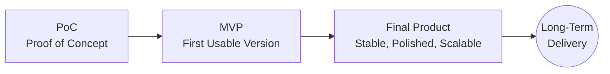
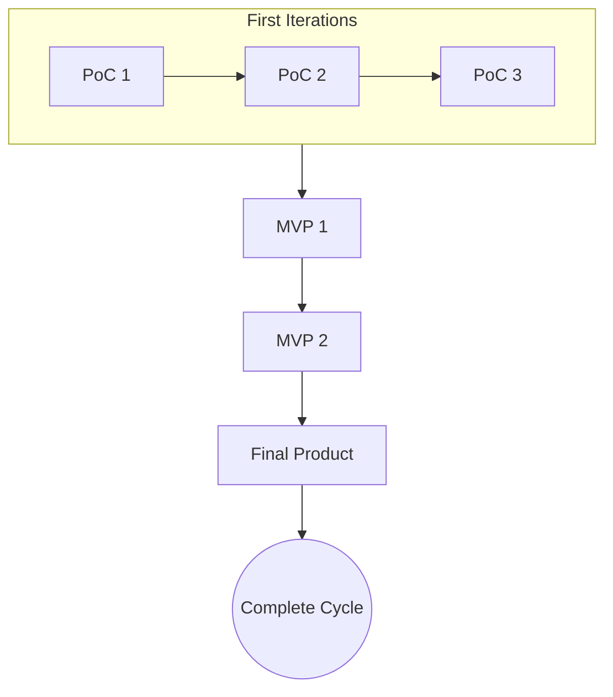
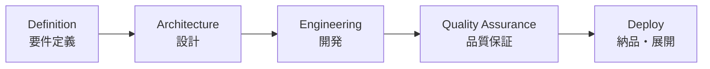
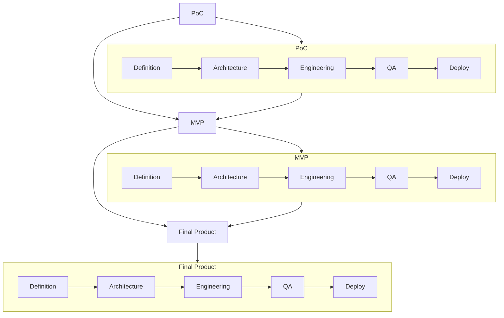

# 🧩 DJIN Tech — Universal Base Process

[← Back to Processes](./README.md)

---

The DJIN Base Process defines **how any creation is born and evolves**, whether internal (DJIN products) or external (client projects).
It's simple, scientific, and iterative: **PoC → MVP → Final Product**.

No stage advances without passing through the 5 fundamental pillars:

1. **Definition (要件定義)**
2. **Architecture (設計)**
3. **Engineering (開発)**
4. **Quality Assurance / QA (品質保証)**
5. **Deploy (納品・展開)**

This is DJIN's most basic flow — and also the most powerful.
It guarantees technical truth, clarity, and continuous evolution.

---

## 🔄 1. Overview (Main Flowchart)

---

## 🧪 2. Natural Process Iteration

PoCs rarely become products directly.
First we prove ideas.
Then we shape them.
Then we refine them.

*Each iteration reduces risk and increases clarity.*

---

## 🧱 3. The 5 Pillars (Invariable)

No phase (PoC, MVP, or Final Product) advances without passing through the 5 fundamental pillars of DJIN Engineering.

### Pillar functions:

* **Definition**: we understand what must exist (clarity → avoid ambiguity)
* **Architecture**: we decide *how* it must exist (design → avoid rework)
* **Engineering**: we implement with technical rigor
* **QA**: we ensure the system works and continues working
* **Deploy**: we close the cycle and deliver with confidence

These pillars repeat **in each PoC, each MVP, each final product**.

---

## 🔁 4. Integration of Pillars with PoC → MVP → Final Product Cycle

---

## 🧠 5. Why does this work?

Because this process:

* reduces risk
* accelerates learning
* allows changes without trauma
* creates solid products
* standardizes quality
* guarantees visibility
* works for hardware, software, AI, systems, research, everything
* and scales as the company grows

This is **DJIN's Universal Base Process** —
the smallest unit of order that organizes all creative chaos.

---

**[← Back to Processes](./README.md)**
