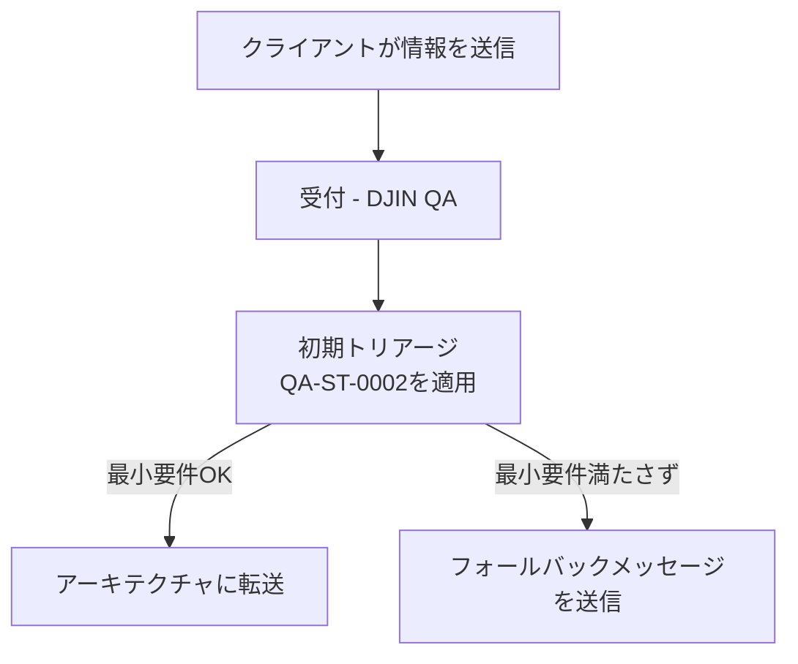

# 🔄 QA-P-0001 — エンドツーエンド品質保証プロセス

[← プロセスに戻る](../README.md)

---

## 📌 目的

このプロセスは、DJINにおける完全な品質保証（QA）フローを定義します。クライアントの初期受付から納品前の最終検証までをカバーします。

QAは**2つの重要なポイント**で機能します：
- **QA[1]** — 受付トリアージ（最小要件を保証）
- **QA[2]** — 最終検証（納品品質を保証）*(定義予定)*

---

## ✅ ハイレベルフロー

---

## 🧪 QA[1] — 初期トリアージ

### 目的

アーキテクチャに転送する前に、**最低限必要な情報**が存在することを確認します。

不完全または曖昧な要件による手戻り、ボトルネック、時間の無駄を防ぎます。

### 担当者

**DJIN Member (QA)** — QA役割に割り当てられたすべてのDJIN Memberがこのプロセスを実行します。

### フロー

### ツール

* [**QA-ST-0002**](../../../standards/ja/QA/QA-ST-0002.md) — QA部門品質基準（運用版）
* [**QA-ST-0002 アシスタント**](TODO) — 初期トリアージアシスタント

---

## 🔍 QA[2] — 最終検証

### 目的

*(定義予定)*

クライアントへの納品前に最終製品が品質基準を満たしていることを確認します。

### 担当者

**DJIN Member (QA)** — QA役割に割り当てられたすべてのDJIN Memberがこのプロセスを実行します。

### フロー

*(定義予定)*

---

## 🧠 なぜこのプロセスが機能するのか

理由：

* **無駄を削減** — 明確な要件なしの作業を回避
* **速度を向上** — アーキテクチャとエンジニアリングが質の高いインプットを受け取る
* **クライアントを保護** — 検証済みで信頼性の高い納品を保証
* **予測可能性を創出** — 各段階が何を期待するかを知っている

---

**[← プロセスに戻る](../README.md)**
