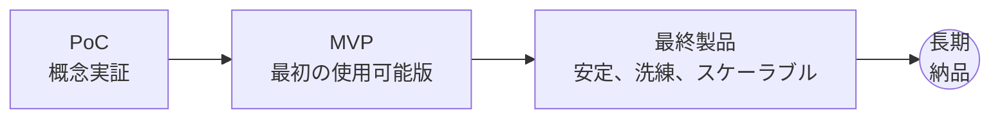
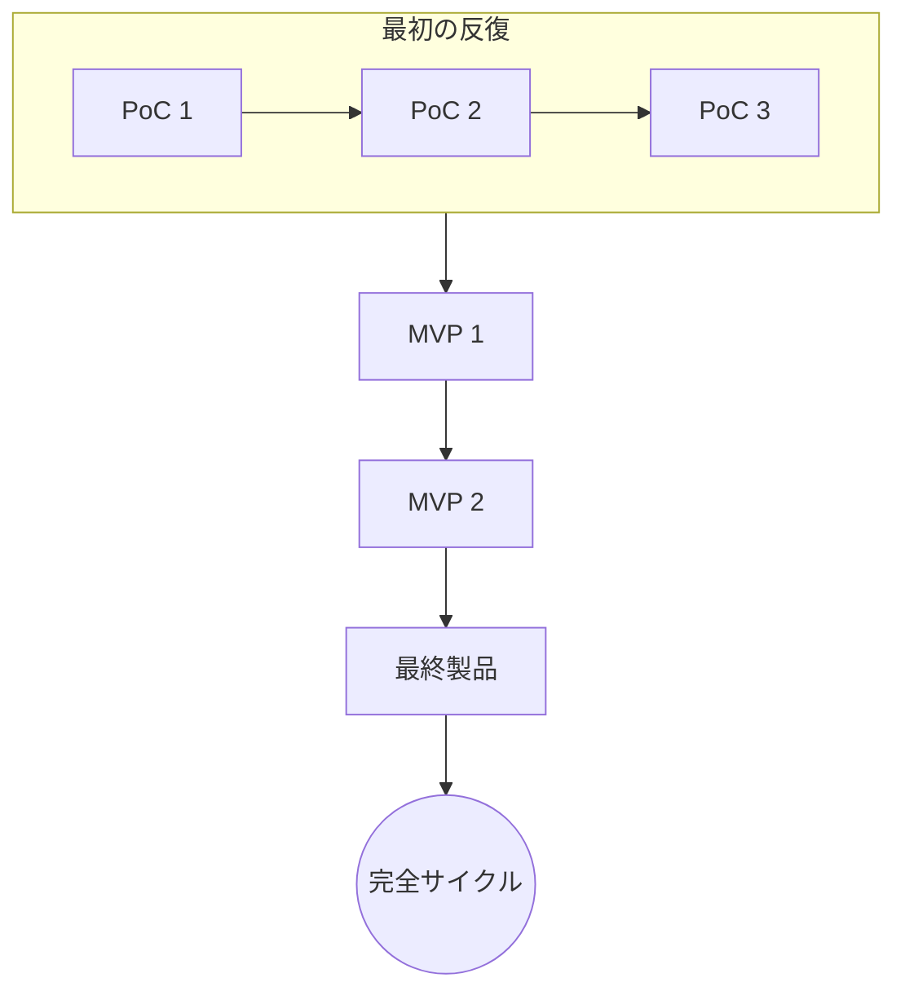
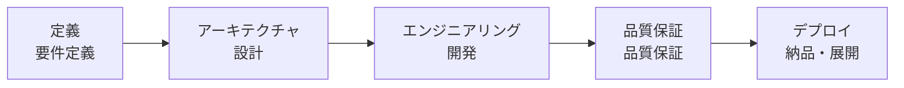
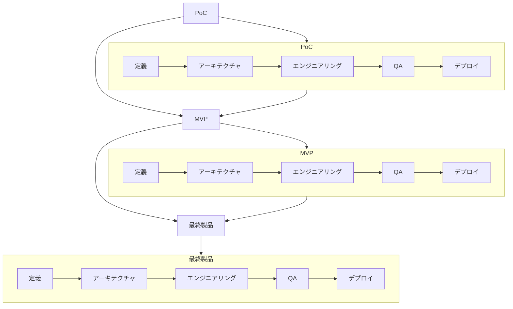

# 🧩 DJIN Tech — ユニバーサルベースプロセス

[← プロセスに戻る](./README.md)

---

DJINベースプロセスは、内部（DJIN製品）でも外部（クライアントプロジェクト）でも、**あらゆる創造がどのように生まれ、進化するか**を定義します。
シンプルで、科学的で、反復的です：**PoC → MVP → 最終製品**。

どの段階も5つの基本的な柱を通過せずには進みません：

1. **定義（要件定義）**
2. **アーキテクチャ（設計）**
3. **エンジニアリング（開発）**
4. **品質保証 / QA（品質保証）**
5. **デプロイ（納品・展開）**

これはDJINの最も基本的なフロー — そして最も強力なものです。
技術的真実、明確性、継続的な進化を保証します。

---

## 🔄 1. 概要（メインフローチャート）

---

## 🧪 2. プロセスの自然な反復

PoCが直接製品になることは稀です。
まずアイデアを証明します。
次に形を与えます。
そして洗練します。

*各反復はリスクを減らし、明確性を高めます。*

---

## 🧱 3. 5つの柱（不変）

どのフェーズ（PoC、MVP、または最終製品）も、DJINエンジニアリングの5つの基本的な柱を通過せずには進みません。

### 柱の機能：

* **定義**: 何が存在すべきかを理解する（明確性 → 曖昧さを避ける）
* **アーキテクチャ**: *どのように*存在すべきかを決定する（設計 → 手戻りを避ける）
* **エンジニアリング**: 技術的厳密さで実装する
* **QA**: システムが機能し、機能し続けることを保証する
* **デプロイ**: サイクルを閉じ、自信を持って提供する

これらの柱は**各PoC、各MVP、各最終製品で繰り返されます**。

---

## 🔁 4. 柱とPoC → MVP → 最終製品サイクルの統合

---

## 🧠 5. なぜこれが機能するのか？

このプロセスは：

* リスクを減らす
* 学習を加速する
* トラウマなしに変更を可能にする
* 堅実な製品を作る
* 品質を標準化する
* 可視性を保証する
* ハードウェア、ソフトウェア、AI、システム、研究、すべてに機能する
* そして会社の成長に合わせてスケールする

これが**DJINのユニバーサルベースプロセス**です —
すべての創造的混沌を整理する最小の秩序単位。

---

**[← プロセスに戻る](./README.md)**
