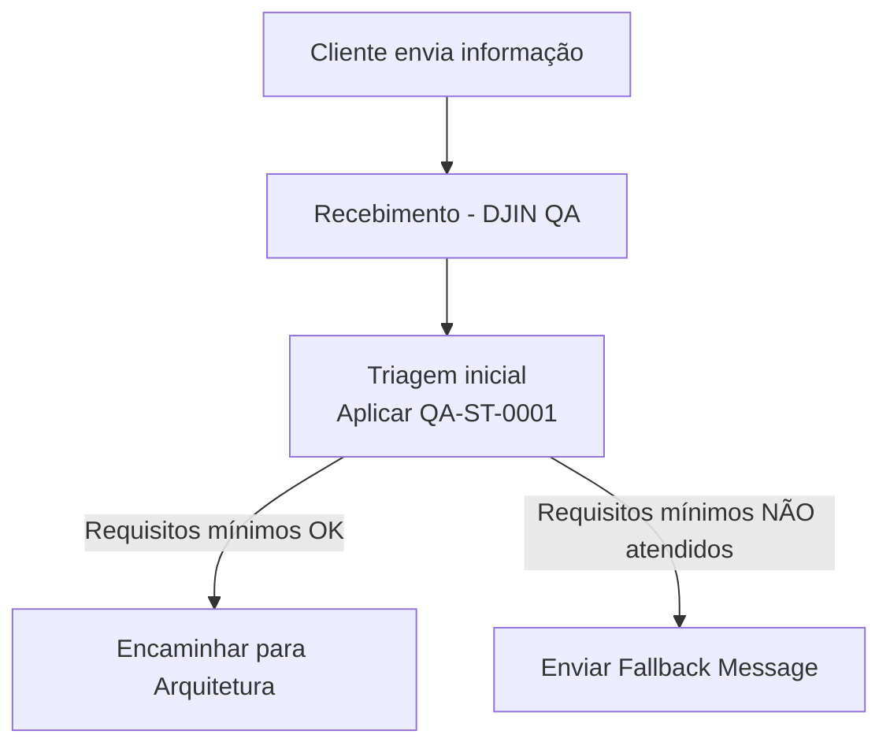

# 🔄 QA-P-0001 — Processo de Controle de Qualidade End-to-End

[← Voltar aos Processos](../README.md)

---

## 📌 Objetivo

Este processo define o fluxo completo de Controle de Qualidade (QA) na DJIN, desde a entrada inicial do cliente até a validação final antes da entrega.

O QA atua em **dois pontos críticos**:
- **QA[1]** — Triagem de entrada (garante requisitos mínimos)
- **QA[2]** — Validação final (garante qualidade de entrega) *(a definir)*

---

## ✅ Fluxo Alto Nível

---

## 🧪 QA[1] — Triagem Inicial

### Objetivo

Garantir que **informações mínimas necessárias** estejam presentes antes de encaminhar para Arquitetura.

Evita retrabalho, bloqueios e perda de tempo com requisitos incompletos ou ambíguos.

### Fluxo

### Ferramentas

* [**QA-ST-0001**](TODO) — Triagem Inicial
* [**QA-ST-0001 Assistente**](TODO) — Assistente de Triagem Inicial

---

## 🔍 QA[2] — Validação Final

### Objetivo

*(A definir)*

Garantir que o produto final atenda aos critérios de qualidade antes da entrega ao cliente.

### Fluxo

*(A definir)*

---

## 🧠 Por Que Este Processo Funciona?

Porque:

* **Reduz desperdício** — evita trabalho sem requisitos claros
* **Aumenta velocidade** — Arquitetura e Engenharia recebem input de qualidade
* **Protege o cliente** — garante entregas validadas e confiáveis
* **Cria previsibilidade** — cada etapa sabe o que esperar

---

**[← Voltar aos Processos](../README.md)**
