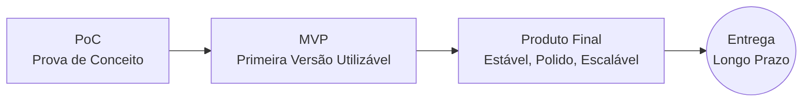
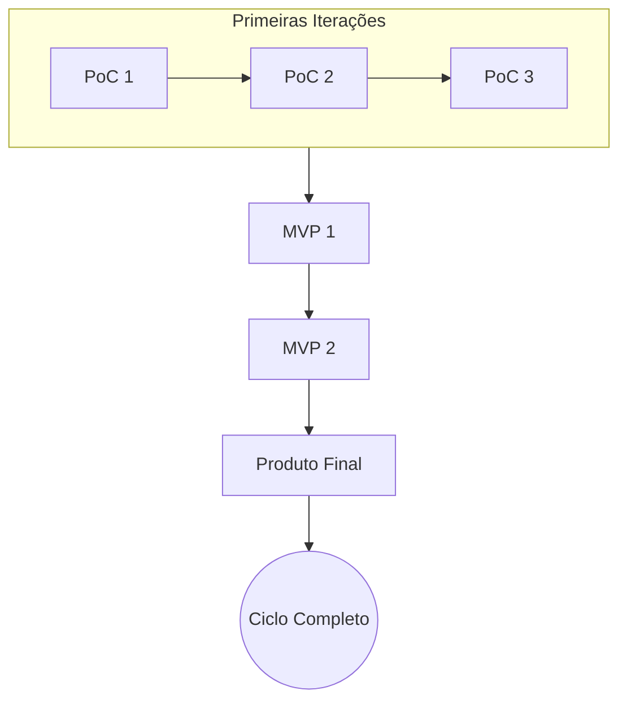
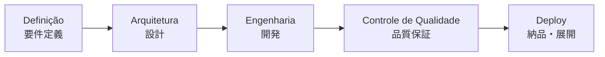
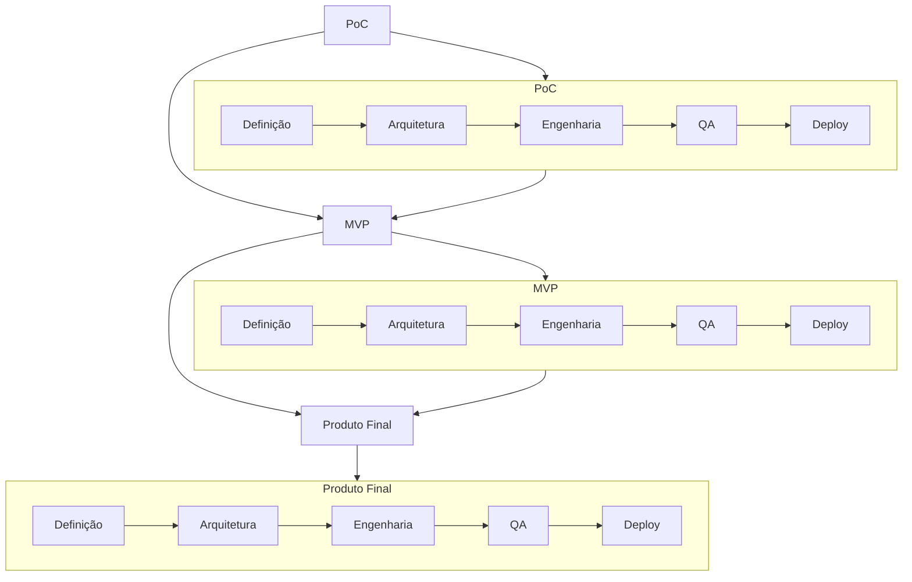

# 🧩 DJIN Tech — Processo Base Universal

[← Voltar aos Processos](./README.md)

---

O Processo Base da DJIN define **como qualquer criação nasce e evolui**, seja interna (produtos DJIN) ou externa (projetos de clientes).
Ele é simples, científico e iterativo: **PoC → MVP → Produto Final**.

Nenhuma etapa avança sem passar pelos 5 pilares fundamentais:

1. **Definição (要件定義)**
2. **Arquitetura (設計)**
3. **Engenharia (開発)**
4. **Controle de Qualidade / QA (品質保証)**
5. **Deploy (納品・展開)**

Esse é o fluxo mais básico da DJIN — e também o mais poderoso.
Ele garante verdade técnica, clareza e evolução contínua.

---

## 🔄 1. Visão Geral (Fluxograma Principal)

---

## 🧪 2. Iteração Natural do Processo

PoCs raramente viram produto direto.
Primeiro provamos ideias.
Depois damos forma.
Depois refinamos.

*Cada iteração reduz risco e aumenta clareza.*

---

## 🧱 3. Os 5 Pilares (Invariáveis)

Nenhuma fase (PoC, MVP ou Produto Final) avança sem passar pelos 5 pilares fundamentais da Engenharia DJIN.

### Função dos pilares:

* **Definição**: entendemos o que deve existir (clareza → evitar ambiguidade)
* **Arquitetura**: decidimos *como* deve existir (design → evitar retrabalho)
* **Engenharia**: implementamos com rigor técnico
* **QA**: garantimos que o sistema funciona e continua funcionando
* **Deploy**: fechamos o ciclo e entregamos com confiança

Esses pilares se repetem **em cada PoC, cada MVP, cada produto final**.

---

## 🔁 4. Integração dos Pilares com o Ciclo PoC → MVP → Produto Final

---

## 🧠 5. Por que isso funciona?

Porque esse processo:

* reduz risco
* acelera aprendizado
* permite mudanças sem trauma
* cria produtos sólidos
* padroniza qualidade
* garante visibilidade
* funciona para hardware, software, AI, sistemas, pesquisa, tudo
* e escala conforme a empresa cresce

Este é o **Processo Base Universal da DJIN** —
a menor unidade de ordem que organiza todo o caos criativo.

---

**[← Voltar aos Processos](./README.md)**
