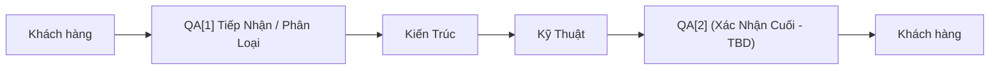
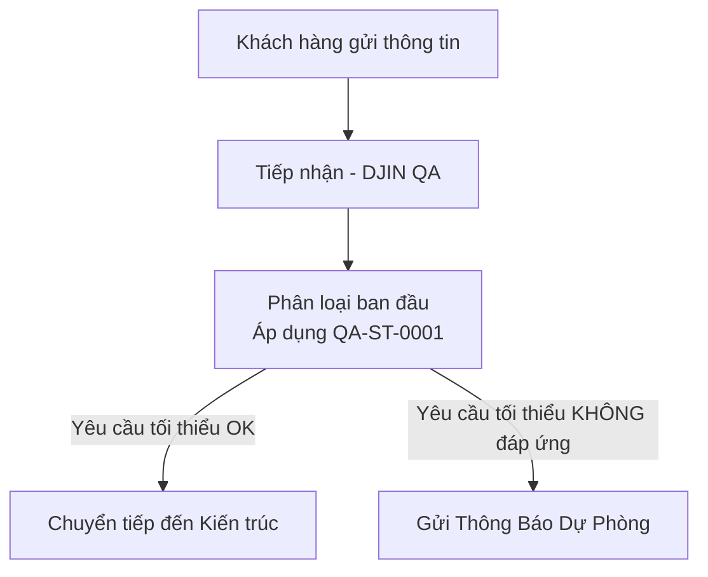

# 🔄 QA-P-0001 — Quy Trình Đảm Bảo Chất Lượng Toàn Diện

[← Quay lại Quy Trình](../README.md)

---

## 📌 Mục Tiêu

Quy trình này định nghĩa luồng Đảm bảo Chất lượng (QA) hoàn chỉnh tại DJIN, từ tiếp nhận khách hàng ban đầu đến xác nhận cuối cùng trước khi giao hàng.

QA hoạt động tại **hai điểm quan trọng**:
- **QA[1]** — Phân loại tiếp nhận (đảm bảo yêu cầu tối thiểu)
- **QA[2]** — Xác nhận cuối cùng (đảm bảo chất lượng giao hàng) *(cần xác định)*

---

## ✅ Luồng Cấp Cao

---

## 🧪 QA[1] — Phân Loại Ban Đầu

### Mục Tiêu

Đảm bảo rằng **thông tin tối thiểu cần thiết** có mặt trước khi chuyển tiếp đến Kiến trúc.

Ngăn chặn làm lại, tắc nghẽn và lãng phí thời gian với các yêu cầu không đầy đủ hoặc mơ hồ.

### Luồng

### Công Cụ

* [**QA-ST-0001**](TODO) — Phân Loại Ban Đầu
* [**QA-ST-0001 Trợ Lý**](TODO) — Trợ Lý Phân Loại Ban Đầu

---

## 🔍 QA[2] — Xác Nhận Cuối Cùng

### Mục Tiêu

*(Cần xác định)*

Đảm bảo sản phẩm cuối cùng đáp ứng tiêu chuẩn chất lượng trước khi giao cho khách hàng.

### Luồng

*(Cần xác định)*

---

## 🧠 Tại Sao Quy Trình Này Hoạt Động

Bởi vì:

* **Giảm lãng phí** — tránh làm việc mà không có yêu cầu rõ ràng
* **Tăng tốc độ** — Kiến trúc và Kỹ thuật nhận được đầu vào chất lượng
* **Bảo vệ khách hàng** — đảm bảo giao hàng được xác thực và đáng tin cậy
* **Tạo khả năng dự đoán** — mỗi giai đoạn biết điều gì mong đợi

---

**[← Quay lại Quy Trình](../README.md)**
