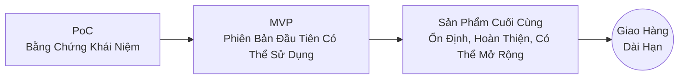
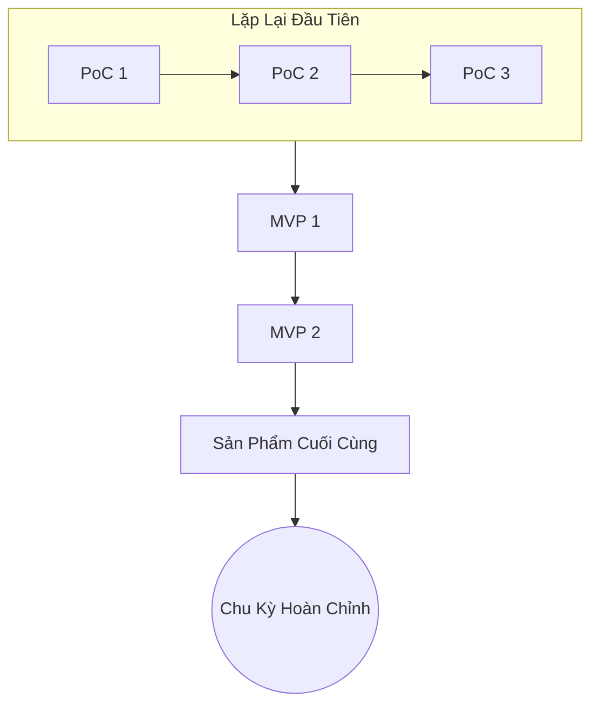
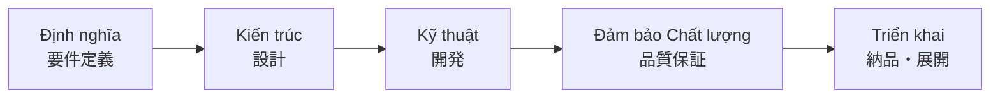
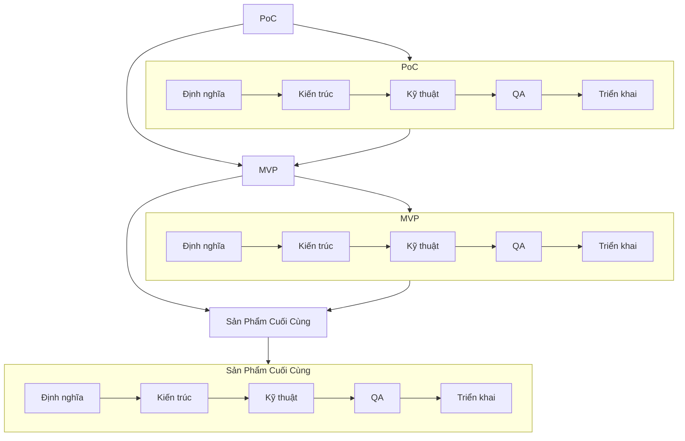

# 🧩 DJIN Tech — Quy Trình Cơ Bản Phổ Quát

[← Quay lại Quy Trình](./README.md)

---

Quy Trình Cơ Bản của DJIN định nghĩa **cách mọi sáng tạo được sinh ra và phát triển**, dù là nội bộ (sản phẩm DJIN) hay bên ngoài (dự án khách hàng).
Nó đơn giản, khoa học và lặp lại: **PoC → MVP → Sản Phẩm Cuối Cùng**.

Không giai đoạn nào tiến triển mà không đi qua 5 trụ cột cơ bản:

1. **Định nghĩa (要件定義)**
2. **Kiến trúc (設計)**
3. **Kỹ thuật (開発)**
4. **Đảm bảo Chất lượng / QA (品質保証)**
5. **Triển khai (納品・展開)**

Đây là luồng cơ bản nhất của DJIN — và cũng mạnh mẽ nhất.
Nó đảm bảo sự thật kỹ thuật, rõ ràng và tiến hóa liên tục.

---

## 🔄 1. Tổng Quan (Sơ Đồ Chính)

---

## 🧪 2. Lặp Lại Tự Nhiên của Quy Trình

PoC hiếm khi trở thành sản phẩm trực tiếp.
Đầu tiên chúng ta chứng minh ý tưởng.
Sau đó chúng ta định hình chúng.
Sau đó chúng ta tinh chỉnh chúng.

*Mỗi lần lặp giảm rủi ro và tăng độ rõ ràng.*

---

## 🧱 3. 5 Trụ Cột (Bất Biến)

Không giai đoạn nào (PoC, MVP, hoặc Sản Phẩm Cuối Cùng) tiến triển mà không đi qua 5 trụ cột cơ bản của Kỹ Thuật DJIN.

### Chức năng của các trụ cột:

* **Định nghĩa**: chúng ta hiểu điều gì phải tồn tại (rõ ràng → tránh mơ hồ)
* **Kiến trúc**: chúng ta quyết định *như thế nào* nó phải tồn tại (thiết kế → tránh làm lại)
* **Kỹ thuật**: chúng ta triển khai với độ chính xác kỹ thuật
* **QA**: chúng ta đảm bảo hệ thống hoạt động và tiếp tục hoạt động
* **Triển khai**: chúng ta đóng chu kỳ và giao hàng với tự tin

Các trụ cột này lặp lại **trong mỗi PoC, mỗi MVP, mỗi sản phẩm cuối cùng**.

---

## 🔁 4. Tích Hợp các Trụ Cột với Chu Kỳ PoC → MVP → Sản Phẩm Cuối Cùng

---

## 🧠 5. Tại Sao Điều Này Hoạt Động?

Bởi vì quy trình này:

* giảm rủi ro
* tăng tốc học tập
* cho phép thay đổi mà không gây chấn thương
* tạo ra sản phẩm vững chắc
* tiêu chuẩn hóa chất lượng
* đảm bảo khả năng hiển thị
* hoạt động cho phần cứng, phần mềm, AI, hệ thống, nghiên cứu, mọi thứ
* và mở rộng khi công ty phát triển

Đây là **Quy Trình Cơ Bản Phổ Quát của DJIN** —
đơn vị trật tự nhỏ nhất tổ chức tất cả hỗn loạn sáng tạo.

---

**[← Quay lại Quy Trình](./README.md)**
