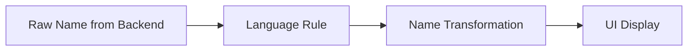
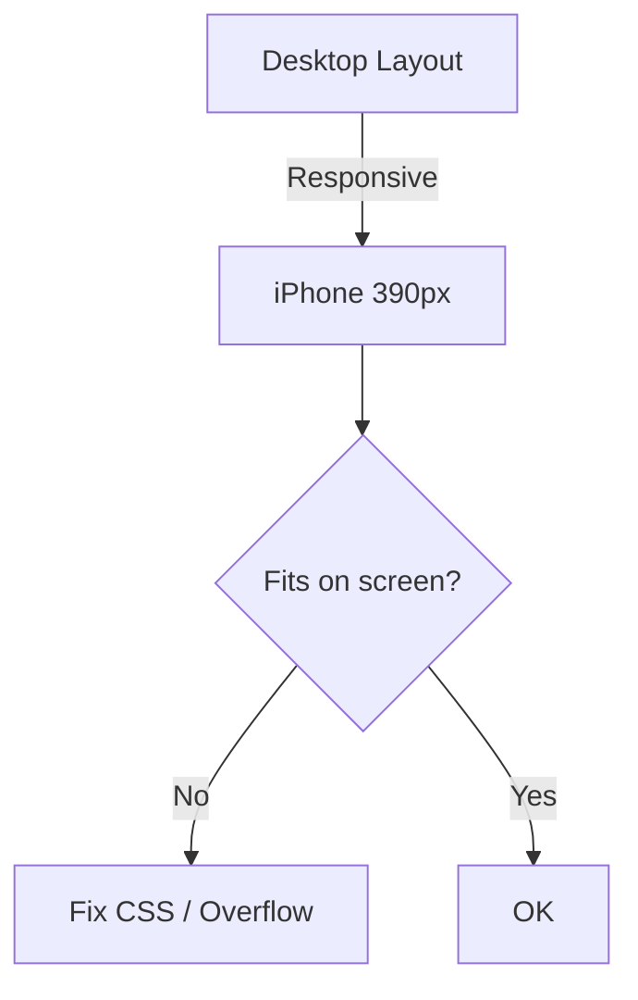

# QA-ST-0001 — Test and Quick Verification Standard (Sketch)

70% formal / 30% operational version — optimized for Engineering + QA.

This Standard defines **how to execute quick, consistent, and reproducible tests**, ensuring that any internal or external delivery maintains the minimum quality level expected by DJIN Tech.

It applies to:

* Internal tests performed by DJIN Members
* Formal QA tests
* Validation before sending something to the client
* High-velocity situations (Strict / Lazy Mode)

The goal is to **eliminate noise**, **identify obvious failures quickly**, and **ensure nothing embarrassing reaches the client**.

---

# 1. POSSIBLE OUTPUTS

Each execution of QA-ST-0001 must result in **one of two official outputs**.

## **Output 1 — Documentation + Handoff to Others**

Use when:

* You found problems that you **should not or cannot** fix directly.

What to deliver:

* List of problems found
* Reference to numbered items in this Standard
* Evidence (screenshots, videos, console prints)

Mandatory actions:

1. Create **Jira Task** with everything documented.
2. Assign **to the Japan team**.
3. Record in Slack / Task comment that:

   * the checklist was executed
   * problems were found
   * the Task was created
4. At end of day, mention that this procedure was performed.

---

## **Output 2 — Immediate Fix + Log**

Use when:

* You found **small**, trivial, or obvious problems
* And already fixed them

What to deliver:

* Simple list of what was found
* What was fixed
* Final evidence (screenshot / video)
* Communication in Slack or Task saying:
  "Checklist executed, problems found and fixed."

---

# 2. OPERATION MODES

---

# 2.1 SCOPE (MANDATORY EXECUTION PARAMETER)

Every test executed under QA-ST-0001 **must strictly respect the defined scope**.

### **Default Scope:**

**The current Task.** Nothing beyond the Task should be modified without explicit instruction from DJIN.

### **Scope Extension (when permitted):**

Can only occur when DJIN provides **clear boundaries**, such as:

* Where the scope starts;
* Where the scope ends;
* What can be changed;
* What **cannot** be changed;
* What expected impact is authorized.

### **Mandatory Responsibility of DJIN Member / QA:**

Even when something is **out of scope**, but you **noticed** that:

* it's wrong,
* it's broken,
* it's inconsistent,
* it's risky,
* or will generate future problems,

QA **cannot ignore it**.

In these cases, it's mandatory to include in the Final Output:

### **Mandatory section in Output:**

**"Out-of-scope items identified but not fixed"**
List:

* the problem,
* where it occurs,
* reference to this Standard's item,
* why it wasn't fixed (e.g., scope not permitted),
* recommendation (e.g., open Task, pass to Architecture, pass to Japan).

### **Important:**

QA **does not expand scope alone**.
QA **does not fix everything it sees**.
But QA **also does not ignore** what it sees.

This rule ensures:

* focus,
* safety,
* transparency,
* absence of hidden rework,
* predictability for Architecture and Management.

---

# 2. OPERATION MODES

QA-ST-0001 can run in two modes, depending on available time.

## **Strict Mode (Complete)**

* Execute **item by item**, without skipping.
* Iterate again if necessary.
* Stop when:

  * There's no more point in iterating, or
  * The pre-agreed time is reached.

## **Lazy Mode (Quick)**

* Define a time limit (e.g., 30 minutes).
* Sweep through all items quickly.
* Mark only the essentials.
* Ideal for quick pre-deliveries.

---

# 3. MANDATORY TOOLS

## 3.0 Translation Validation

There are **two valid ways** to validate translations:

### **Option 1 — Validation by Native DJIN Member**

* **DJIN Members from the country/region where the language is native** can validate translations directly
* They **must** use DeepL and/or Takoboto as **support tools in case of doubt**
* They are not required to validate exclusively via DeepL/Takoboto, but these tools **must be available** for consultation

### **Option 2 — Validation via Tools (for non-natives)**

The following tools **must be opened and used consciously**:

* **DeepL** — For complete translations.
* **Takoboto** — For checking individual words.

---

## 3.1 Recipes (Automation and Support Tools via CLI / AI Agents)

Before or during QA-ST-0001 execution, **check if there are available recipes** in the project repository or internal **DJIN-Work** documentation that can:

* automate checks,
* help inspect code snippets,
* validate translations,
* identify typos,
* execute repetitive tests,
* speed up navigation and data collection,
* or analyze UI/UX patterns.

If applicable recipes exist:

* Use them according to your project's permission.
* Document in the output if any recipe was used.
* If the recipe finds something automatically, treat it as evidence.

### ⚠ TODO (official, pending implementation)

An **official directory or recipe repository** will be added containing:

* CLI commands approved by DJIN,
* AI agents specialized in UI, code, and pattern review,
* inspection scripts,
* consistent and versioned instructions.

For now:

* Only use recipes you **have access to and permission for**.
* If no recipes are available, **execute everything manually** focusing on your Task scope.
* Do not use unapproved external tools.

---

The following tools **must be opened and used consciously**:

* **DeepL** — For complete translations.
* **Takoboto** — For checking individual words.

You **should not** use Google Translate to validate final text.

---

# 4. OFFICIAL CHECKLIST (Items 1 → 11)

# **1 — Environment and Credentials (Mandatory before starting)**

In the final output, make explicit:

* Environment used:

  * `in-house-preview` (internal tests)
  * `customer-preview` (tests with client)
  * `production`
* Credentials: email/ID + password
* Name displayed in the system (for display tests)

---

# **2 — Translations**

### **Table — Right vs Wrong (Translations and Name Display)**

| Case                           | Wrong                       | Right                                   |
| ------------------------------ | --------------------------- | --------------------------------------- |
| JP UI — Name inverted          | Tarō Yamada                 | 山田 太郎 (Yamada Tarō)                     |
| PT-BR UI — Inverted order      | Silva João                  | João Silva                              |
| EN UI — Wrong full name        | Smith John                  | John Smith                              |
| Single word wrongly translated | "Attendance" → 出席する (verb) | "Attendance" → 出席 (correct noun)        |
| DeepL ignored                  | Hybrid PT/EN message        | Full text translated via DeepL          |

---

**Visual example (Mermaid) for name display logic:**

*(Optional use — just visual support.)*

---

## 2.1 General rules

### For Native DJIN Members of the Target Language

* Can validate translations directly using their native knowledge
* **Must** use DeepL and/or Takoboto as **support in case of doubt**
* Not required to follow the flow below, but tools must be available

### For Non-Native DJIN Members

* Complete texts → **DeepL** (source language → Japanese)
* Individual words:

  1. Find the word in English (DeepL if needed)
  2. Search in **Takoboto**
  3. Use the **first result**

## 2.2 Avatars and name display

Name order depends on UI language:

| Language   | Order                |
| ---------- | -------------------- |
| JP         | Last Name → First Name |
| PT-BR      | First Name → Last Name |
| EN         | First Name → Last Name |
| KR         | Last Name → First Name |
| CN         | Last Name → First Name |
| Vietnamese | Last Name → First Name |
| Tagalog    | First Name → Last Name |

**Middle name** is treated as part of the last name, except where the system explicitly separates 3 fields.

Quick checklist:

* Name displayed correctly?
* Avatar correct?
* Name not inverted?

---

# **3 — Spellcheck (Code + UI)**

Verify:

* Typos in code
* Typos in backend
* Typos in UI

Rules:

* Translations x → Japanese → always validate in DeepL
* Individual words → Takoboto
* If something doesn't match → **report**

---

# **4 — Verify Basic Data**

* No placeholders
* Nothing offensive
* Minimally coherent texts
* Appropriate fictional names:

  * JP: Yamada Tarō
  * PT: João Silva

---

# **5 — Verify Interface Translation**

* Main buttons and texts correctly translated
* Nothing in pt-BR where it should be in Japanese
* Nothing missing in English

Name order according to language (rule from item 2)

---

# **6 — Leaks**

Look for things like:

* UUIDs
* Internal IDs
* stacktraces
* undefined / null / [object Object]
* raw API errors
* untranslated technical messages

If found → block delivery.

---

# **7 — Layout**

### **Table — Right vs Wrong (Layout and Responsiveness)**

| Case                        | Wrong                        | Right                          |
| --------------------------- | ---------------------------- | ------------------------------ |
| Unexpected horizontal scroll | Screen shifts horizontally   | Layout without lateral overflow |
| Button cut off              | Half invisible               | 100% visible at all widths     |
| Text overflowing container  | Title crosses border         | Title with proper wrap         |
| List without padding        | Items stuck together         | Uniform padding                |

---

### **Visual Mermaid example — Responsiveness**

---

Verify main flow in:

* Desktop
* iPhone width (~390px)

Check:

* Nothing overflows container
* Buttons clickable
* Lists load
* No horizontal scroll

---

# **8 — Main Flow**

For **each screen**:

* Click main CTA
* Create → Edit → Delete 1 record

Validate if:

* Doesn't freeze
* Doesn't break layout
* Navigation works
* No ugly alerts

---

# **9 — Spelling and Messages**

Golden question:
"Would I be embarrassed to show this sentence to the client?"

If yes → fix or report.

---

# **10 — Colors and Branding**

Quick check:

* Colors outside standard
* Raw Vuetify components
* Low contrast

No deep refactoring — just acceptable appearance.

---

# **11 — Evidence (Screenshot / Video)**

### **Table — Right vs Wrong (Evidence)**

| Case              | Wrong                      | Right                                |
| ----------------- | -------------------------- | ------------------------------------ |
| Cropped screenshot | Part of interface missing  | Full screen with clear focus         |
| Incomplete video  | Only opens screen          | Shows CTA → Create → Edit → Delete  |
| No context        | Loose file                 | Name + environment + user            |

---

# ✔ PRINTABLE CHECKLIST (Ultra Direct)

**[→ Access Printable Checklist](../../../toolbox/QA-ST-0001/checklist-en.md)**

Use the checklist above for quick and objective QA-ST-0001 executions.

---

Before delivery:

* 1 screenshot of each screen
* 1 short video of main flow

Final question:

> **Would I show this to the client without fear?**

If the answer is "no", fix it.

---

# CLOSING

This Standard defines **the minimum acceptable quality** for any delivery.
It is mandatory for all DJIN Members, and serves as an umbrella of consistency at high velocity.

Executing QA-ST-0001 before any delivery reduces noise, increases predictability, and protects DJIN Tech's technical reputation.
