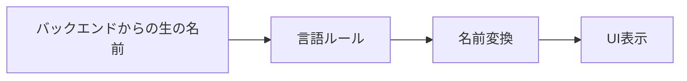
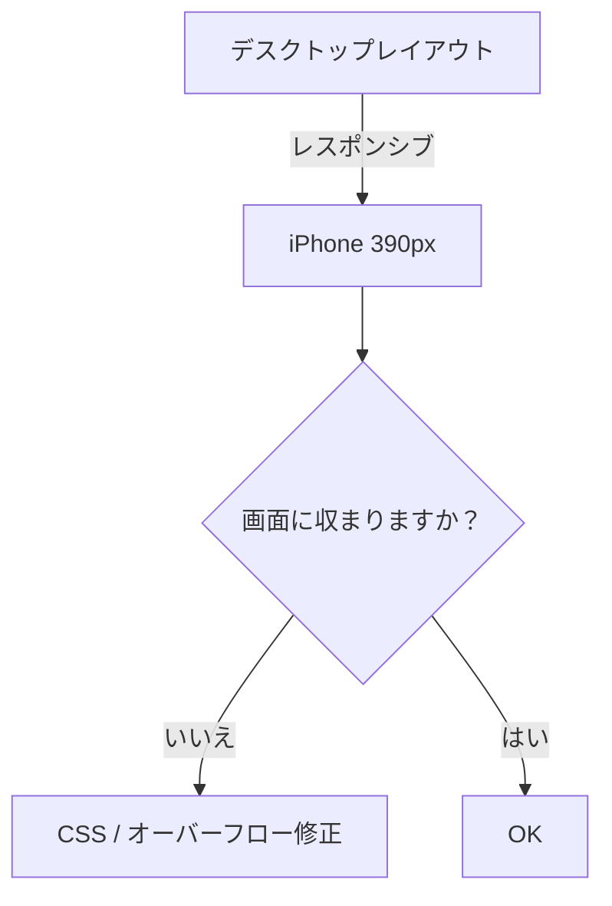

# QA-ST-0001 — テストおよび迅速検証基準（スケッチ）

70%フォーマル / 30%運用バージョン — エンジニアリング + QA向けに最適化。

この基準は、**迅速で一貫性があり再現可能なテストを実行する方法**を定義し、すべての内部または外部の成果物がDJIN Techが期待する最低限の品質レベルを維持することを保証します。

適用対象：

* DJIN Membersが実行する内部テスト
* 正式なQAテスト
* クライアントに送信する前の検証
* 高速状況（Strict / Lazy Mode）

目標は、**ノイズを排除**し、**明らかな障害を迅速に特定**し、**恥ずかしいものがクライアントに届かないようにする**ことです。

---

# 1. 可能な出力

QA-ST-0001の各実行は、**2つの公式出力のいずれか**になる必要があります。

## **出力1 — ドキュメント + 他者への引き継ぎ**

使用するタイミング：

* 直接修正**すべきでない、またはできない**問題を発見した場合。

提供するもの：

* 発見された問題のリスト
* この基準の番号付き項目への参照
* 証拠（スクリーンショット、ビデオ、コンソールプリント）

必須アクション：

1. すべてドキュメント化した**JiraタスK**を作成。
2. **日本チーム**に割り当て。
3. Slack / タスクコメントに以下を記録：

   * チェックリストが実行されたこと
   * 問題が発見されたこと
   * タスクが作成されたこと
4. 終業時に、この手順が実行されたことを言及。

---

## **出力2 — 即座の修正 + ログ**

使用するタイミング：

* **小さな**、些細な、または明らかな問題を発見した場合
* そしてすでに修正した場合

提供するもの：

* 発見されたものの簡単なリスト
* 修正されたもの
* 最終証拠（スクリーンショット / ビデオ）
* Slackまたはタスクでのコミュニケーション：
  「チェックリスト実行、問題発見および修正完了。」

---

# 2. 操作モード

---

# 2.1 スコープ（必須実行パラメータ）

QA-ST-0001で実行されるすべてのテストは、**定義されたスコープを厳密に尊重する必要があります**。

### **デフォルトスコープ：**

**現在のタスク。** DJINからの明示的な指示なしに、タスクを超えて何も変更してはなりません。

### **スコープ拡張（許可された場合）：**

DJINが**明確な境界**を提供した場合にのみ発生できます：

* スコープがどこから始まるか；
* スコープがどこで終わるか；
* 何を変更できるか；
* 何を変更**できない**か；
* どの予想される影響が承認されているか。

### **DJIN Member / QAの必須責任：**

何かが**スコープ外**であっても、あなたが以下に**気付いた**場合：

* 間違っている、
* 壊れている、
* 一貫性がない、
* リスクがある、
* または将来問題を引き起こす、

QA**は無視できません**。

このような場合、最終出力に含めることが必須です：

### **出力の必須セクション：**

**「スコープ外の項目が特定されたが修正されなかった」**
リスト：

* 問題、
* どこで発生するか、
* この基準の項目への参照、
* なぜ修正されなかったか（例：スコープが許可されていない）、
* 推奨事項（例：タスクを開く、アーキテクチャに渡す、日本に渡す）。

### **重要：**

QA**は単独でスコープを拡大しません**。
QA**は見えるものすべてを修正しません**。
しかしQA**も見たものを無視しません**。

このルールは以下を保証します：

* フォーカス、
* 安全性、
* 透明性、
* 隠れた手戻りの不在、
* アーキテクチャと管理の予測可能性。

---

# 2. 操作モード

QA-ST-0001は、利用可能な時間に応じて2つのモードで実行できます。

## **Strictモード（完全）**

* **項目ごとに**実行し、スキップしない。
* 必要に応じて再度イテレート。
* 以下の場合に停止：

  * これ以上イテレートする意味がない、または
  * 事前に合意された時間に達した。

## **Lazyモード（クイック）**

* 時間制限を定義（例：30分）。
* すべての項目を迅速にスイープ。
* 必須事項のみをマーク。
* 迅速な事前配信に最適。

---

# 3. 必須ツール

以下のツールは**意識的に開いて使用する必要があります**：

* **DeepL** — 完全な翻訳用。
* **Takoboto** — 個々の単語のチェック用。

---

## 3.1 レシピ（CLI / AIエージェント経由の自動化およびサポートツール）

QA-ST-0001の実行前または実行中に、プロジェクトリポジトリまたは内部**DJIN-Work**ドキュメントに**利用可能なレシピがあるか確認**してください：

* チェックの自動化、
* コードスニペットの検査支援、
* 翻訳の検証、
* タイポの識別、
* 反復テストの実行、
* ナビゲーションとデータ収集の高速化、
* またはUI/UXパターンの分析。

適用可能なレシピが存在する場合：

* プロジェクトの許可に従って使用してください。
* レシピが使用された場合は出力にドキュメント化してください。
* レシピが自動的に何かを見つけた場合は、証拠として扱ってください。

### ⚠ TODO（公式、実装保留中）

以下を含む**公式ディレクトリまたはレシピリポジトリ**が追加されます：

* DJINによって承認されたCLIコマンド、
* UI、コード、パターンレビューに特化したAIエージェント、
* 検査スクリプト、
* 一貫性のあるバージョン管理された指示。

現時点では：

* **アクセスおよび許可があるレシピのみ**使用してください。
* レシピが利用できない場合は、**すべて手動で実行**し、タスクのスコープに焦点を当ててください。
* 未承認の外部ツールを使用しないでください。

---

以下のツールは**意識的に開いて使用する必要があります**：

* **DeepL** — 完全な翻訳用。
* **Takoboto** — 個々の単語のチェック用。

最終テキストを検証するためにGoogle翻訳を**使用すべきではありません**。

---

# 4. 公式チェックリスト（項目1 → 11）

# **1 — 環境と認証情報（開始前に必須）**

最終出力で明示的にする：

* 使用した環境：

  * `in-house-preview`（内部テスト）
  * `customer-preview`（クライアントとのテスト）
  * `production`
* 認証情報：email/ID + パスワード
* システムに表示される名前（表示テスト用）

---

# **2 — 翻訳**

### **表 — 正しい vs 間違い（翻訳と名前表示）**

| ケース                 | 間違い              | 正しい                      |
| -------------------- | ---------------- | ------------------------ |
| JP UI — 名前が逆         | Tarō Yamada      | 山田 太郎（Yamada Tarō）       |
| PT-BR UI — 順序が逆      | Silva João       | João Silva               |
| EN UI — フルネームが間違い    | Smith John       | John Smith               |
| 単語が誤って翻訳された         | "Attendance" → 出席する（動詞） | "Attendance" → 出席（正しい名詞） |
| DeepLが無視された         | ハイブリッドPT/ENメッセージ | DeepL経由で完全に翻訳されたテキスト    |

---

**名前表示ロジックの視覚的例（Mermaid）：**

*（オプション使用 — 視覚的サポートのみ。）*

---

## 2.1 一般ルール

## 2.1 一般ルール

* 完全なテキスト → **DeepL**（元の言語 → 日本語）
* 個々の単語：

  1. 英語で単語を見つける（必要に応じてDeepL）
  2. **Takoboto**で検索
  3. **最初の結果**を使用

## 2.2 アバターと名前表示

名前の順序はUIの言語に依存します：

| 言語         | 順序     |
| ---------- | ------ |
| JP         | 姓 → 名  |
| PT-BR      | 名 → 姓  |
| EN         | 名 → 姓  |
| KR         | 姓 → 名  |
| CN         | 姓 → 名  |
| Vietnamese | 姓 → 名  |
| Tagalog    | 名 → 姓  |

**ミドルネーム**は、システムが明示的に3つのフィールドを分離する場合を除き、姓の一部として扱われます。

クイックチェックリスト：

* 名前が正しく表示されていますか？
* アバターは正しいですか？
* 名前が逆になっていませんか？

---

# **3 — スペルチェック（コード + UI）**

確認：

* コード内のタイポ
* バックエンド内のタイポ
* UI内のタイポ

ルール：

* 翻訳 x → 日本語 → 常にDeepLで検証
* 個々の単語 → Takoboto
* 何かが一致しない場合 → **報告**

---

# **4 — 基本データの確認**

* プレースホルダーなし
* 不快なものなし
* 最低限一貫性のあるテキスト
* 適切な架空の名前：

  * JP：山田太郎
  * PT：João Silva

---

# **5 — インターフェース翻訳の確認**

* 主要なボタンとテキストが正しく翻訳されている
* 日本語であるべき場所にpt-BRがない
* 英語で欠落しているものがない

言語に応じた名前の順序（項目2のルール）

---

# **6 — リーク**

以下のようなものを探す：

* UUID
* 内部ID
* スタックトレース
* undefined / null / [object Object]
* 生のAPIエラー
* 翻訳されていない技術メッセージ

見つかった場合 → 配信をブロック。

---

# **7 — レイアウト**

### **表 — 正しい vs 間違い（レイアウトとレスポンシブ性）**

| ケース              | 間違い          | 正しい            |
| ---------------- | ------------ | -------------- |
| 予期しない水平スクロール     | 画面が水平にシフト    | 横オーバーフローのないレイアウト |
| ボタンが切れている        | 半分見えない       | すべての幅で100％表示    |
| テキストがコンテナをオーバーフロー | タイトルが境界を越える  | 適切なラップを持つタイトル   |
| パディングのないリスト      | アイテムがくっついている | 均一なパディング        |

---

### **視覚的Mermaid例 — レスポンシブ性**

---

以下で主要なフローを確認：

* デスクトップ
* iPhone幅（〜390px）

チェック：

* コンテナをオーバーフローしていない
* ボタンがクリック可能
* リストが読み込まれる
* 水平スクロールなし

---

# **8 — 主要フロー**

**各画面**について：

* メインCTAをクリック
* 1レコードを作成 → 編集 → 削除

検証：

* フリーズしない
* レイアウトが壊れない
* ナビゲーションが機能する
* 醜いアラートが表示されない

---

# **9 — スペルとメッセージ**

ゴールデンクエスチョン：
「この文をクライアントに見せるのが恥ずかしいですか？」

はいの場合 → 修正または報告。

---

# **10 — 色とブランディング**

クイックチェック：

* 標準外の色
* 生のVuetifyコンポーネント
* 低コントラスト

深いリファクタリングなし — 受け入れ可能な外観のみ。

---

# **11 — 証拠（スクリーンショット / ビデオ）**

### **表 — 正しい vs 間違い（証拠）**

| ケース        | 間違い         | 正しい                        |
| ---------- | ----------- | -------------------------- |
| 切り取られたスクリーンショット | インターフェースの一部が欠落 | 明確な焦点を持つ全画面                |
| 不完全なビデオ    | 画面を開くだけ     | CTA → 作成 → 編集 → 削除を表示     |
| コンテキストなし   | 緩いファイル      | 名前 + 環境 + ユーザー             |

---

# ✔ 印刷可能チェックリスト（超直接的）

**[→ 印刷可能チェックリストにアクセス](../../../toolbox/QA-ST-0001/checklist-ja.md)**

迅速かつ客観的なQA-ST-0001実行には、上記のチェックリストを使用してください。

---

配信前：

* 各画面の1スクリーンショット
* 主要フローの1つの短いビデオ

最終質問：

> **これをクライアントに恐れずに見せますか？**

答えが「いいえ」の場合、修正してください。

---

# 終了

この基準は、すべての成果物の**最低限受け入れ可能な品質**を定義します。
これはすべてのDJIN Membersにとって必須であり、高速での一貫性の傘として機能します。

あらゆる配信前にQA-ST-0001を実行することで、ノイズを削減し、予測可能性を高め、DJIN Techの技術的評判を保護します。
