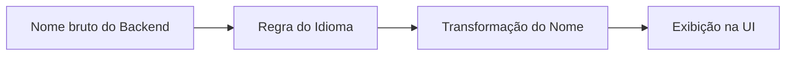
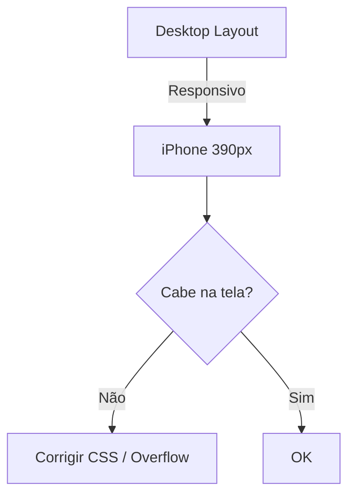

# QA-ST-0001 — Standard de Teste e Verificação Rápida (Sketch)

Este Standard define **como executar testes rápidos, consistentes e reproduzíveis**, garantindo que qualquer entrega interna ou externa mantenha o nível mínimo de qualidade esperado pela DJIN Tech.

Ele se aplica a:

* Testes internos realizados por DJIN Members
* Testes formais de QA
* Validação antes de enviar algo ao cliente
* Situações de alta velocidade (Strict / Lazy Mode)

O objetivo é **eliminar ruído**, **identificar falhas óbvias rapidamente** e **garantir que nada vergonhoso chegue ao cliente**.

---

# 1. POSSÍVEIS OUTPUTS

Cada execução do QA-ST-0001 deve resultar em **um dos dois outputs oficiais**.

## **Output 1 — Documentação + Passagem para terceiros**

Use quando:

* Você encontrou problemas que **não deve ou não pode** corrigir diretamente.

O que entregar:

* Lista dos problemas encontrados
* Referência aos itens numerados deste Standard
* Evidências (screenshots, vídeos, prints de console)

Ações obrigatórias:

1. Criar **Task no Jira** com tudo documentado **ou** reutilizar Tasks existentes se aplicável.
2. Atribuir novamente ao Responsável ( geralmente voltar uma coluna no Jira).
   * Se o Responsável estiver fora do escopo, **repassar para o Gestão**.
   * Ex: task existe, esta na coluna D ("Testes de Operação"). comenta e volta para coluna C ("para fazer").
   Obs: usado letras para explicar sobre as colunas por que o nome real das colunas pode mudar com o tempo/projeto. mas acredito que a logica esta clara e aplicavel em qualquer projeto.
3. Registrar no Slack / comentário da Task que:
   * o checklist foi executado → **[→ Acessar Checklist](../../../toolbox/QA-ST-0001/checklist-pt-BR.md)**
   * problemas foram encontrados
   * a Task foi criada
4. No final do expediente, mencionar que este procedimento foi realizado.

---

## **Output 2 — Correção imediata + Registro**

Use quando:

* Você encontrou problemas **pequenos**, triviais ou óbvios
* E já corrigiu

O que entregar:

* Lista simples do que foi encontrado
* O que foi corrigido
* Evidência final (screenshot / vídeo)
* Comunicação no Slack ou Task dizendo:
  “Checklist executado, problemas encontrados e corrigidos.”

---

# 2. MODOS DE OPERAÇÃO

---

# 2.1 ESCOPO (PARÂMETRO OBRIGATÓRIO DE EXECUÇÃO)

Todo teste executado sob o QA-ST-0001 **deve respeitar estritamente o escopo definido**.

### **Escopo Padrão:**

**A Task atual.** Nada além da Task deve ser modificado sem instrução explícita da DJIN.

### **Extensão de Escopo (quando permitido):**

Apenas pode ocorrer quando a DJIN fornecer **fronteiras claras**, como:

* Onde o escopo começa;
* Onde o escopo termina;
* O que pode ser alterado;
* O que **não** pode ser alterado;
* Qual impacto esperado está autorizado.

### **Responsabilidade Obrigatória do DJIN Member / QA:**

Mesmo quando algo está **fora do escopo**, mas você **percebeu** que:

* está errado,
* está quebrado,
* está inconsistente,
* é arriscado,
* ou vai gerar problemas futuros,

o QA **não pode ignorar**.

Nesses casos, é obrigatório incluir no Output Final:

### **Seção obrigatória no Output:**

**“Itens fora do escopo identificados, mas não corrigidos”**
Listar:

* o problema,
* onde ocorre,
* referência ao item deste Standard,
* por que não foi corrigido (ex.: escopo não permitido),
* recomendação (ex.: abrir Task, repassar p/ Arquitetura, repassar p/ Japão).

### **Importante:**

O QA **não expande o escopo sozinho**.
O QA **não corrige tudo que vê**.
Mas o QA **também não ignora** o que vê.

Essa regra garante:

* foco,
* segurança,
* transparência,
* ausência de retrabalho oculto,
* previsibilidade para Arquitetura e Gestão.

---

# 2. MODOS DE OPERAÇÃO

O QA-ST-0001 pode rodar em dois modos, dependendo do tempo disponível.

## **Modo Strict (Completo)**

* Executa **item por item**, sem pular.
* Itera novamente se necessário.
* Para quando:

  * Não houver mais sentido em iterar, ou
  * O tempo pré-acordado for atingido.

## **Modo Lazy (Rápido)**

* Defina um limite de tempo (ex.: 30 minutos).
* Varra todos os itens rapidamente.
* Marque apenas o essencial.
* Ideal para pré-entregas rápidas.

---

# 3. FERRAMENTAS OBRIGATÓRIAS

## 3.0 Validação de Traduções

Existem **duas formas válidas** de validar traduções:

### **Opção 1 — Validação por DJIN Member Nativo**

* **DJIN Members do país/região onde o idioma é nativo** podem validar traduções diretamente
* Eles **devem** usar DeepL e/ou Takoboto como ferramentas de **suporte em caso de dúvida**
* Não são obrigados a validar exclusivamente via DeepL/Takoboto, mas essas ferramentas **devem estar disponíveis** para consulta

### **Opção 2 — Validação via Ferramentas (para não-nativos)**

As seguintes ferramentas **devem ser abertas e usadas conscientemente**:

* **DeepL** — Para traduções completas.
* **Takoboto** — Para conferência de palavras soltas.

---

## 3.1 Recipes (Ferramentas de Automação e Apoio via CLI / AI Agents)

Antes ou durante a execução do QA-ST-0001, **verifique se existem recipes disponíveis** no repositório do projeto ou na documentação interna **DJIN-Work** que possam:

* automatizar conferências,
* ajudar na inspeção de trechos de código,
* validar traduções,
* identificar typos,
* executar testes repetitivos,
* acelerar a navegação e coleta de dados,
* ou analisar padrões de UI/UX.

Se existirem recipes aplicáveis:

* Utilize-os de acordo com a permissão do seu projeto.
* Documente no output se algum recipe foi usado.
* Caso o recipe encontre algo automaticamente, trate como evidência.

### ⚠ TODO (oficial, pendente de implementação)

Será adicionado um **diretório ou repositório oficial de recipes** contendo:

* CLI commands aprovados pela DJIN,
* AI agents especializados em revisão de UI, código e padrões,
* scripts de inspeção,
* instruções consistentes e versionadas.

Por enquanto:

* Utilize apenas os recipes aos quais você **tem acesso e permissão**.
* Caso não tenha recipes disponíveis, **execute tudo manualmente** focando no escopo da sua Task.
* Não utilize ferramentas externas não aprovadas.

---

As seguintes ferramentas **devem ser abertas e usadas conscientemente**:

* **DeepL** — Para traduções completas.
* **Takoboto** — Para conferência de palavras soltas.

Você **não deve** usar Google Tradutor para validar texto final.

---

# 4. CHECKLIST OFICIAL (Itens 1 → 11)

# **1 — Ambiente e Credenciais (Obrigatório antes de começar)**

No output final, deixe explícito:

* Ambiente utilizado:

  * `in-house-preview` (testes internos)
  * `customer-preview` (testes com o cliente)
  * `production`
* Credenciais: email/ID + senha
* Nome exibido no sistema (para testes de exibição)

---

# **2 — Traduções**

### **Tabela — Certo vs Errado (Traduções e Exibição de Nome)**

| Caso                           | Errado                      | Certo                                   |
| ------------------------------ | --------------------------- | --------------------------------------- |
| JP UI — Nome invertido         | Tarō Yamada                 | 山田 太郎 (Yamada Tarō)                     |
| PT-BR UI — Ordem invertida     | Silva João                  | João Silva                              |
| EN UI — Nome completo errado   | Smith John                  | John Smith                              |
| Palavra solta traduzida errado | “Attendance” → 出席する (verbo) | “Attendance” → 出席 (substantivo correto) |
| DeepL ignorado                 | Mensagem híbrida PT/EN      | Texto completo traduzido via DeepL      |

---

**Exemplo visual (Mermaid) para lógica de exibição do nome:**

*(Uso opcional — apenas apoio visual.)*

---

## 2.1 Regras gerais

### Para DJIN Members Nativos do Idioma Alvo

* Podem validar traduções diretamente usando seu conhecimento nativo
* **Devem** usar DeepL e/ou Takoboto como **suporte em caso de dúvida**
* Não são obrigados a seguir o fluxo abaixo, mas devem ter as ferramentas disponíveis

### Para DJIN Members Não-Nativos

* Textos completos → **DeepL** (idioma origem → japonês)
* Palavras soltas:

  1. Descobrir a palavra em inglês (DeepL se precisar)
  2. Procurar no **Takoboto**
  3. Usar o **primeiro resultado**

## 2.2 Avatares e exibição de nomes

A ordem do nome depende do idioma da UI:

| Idioma     | Ordem            |
| ---------- | ---------------- |
| JP         | Sobrenome → Nome |
| PT-BR      | Nome → Sobrenome |
| EN         | Nome → Sobrenome |
| KR         | Sobrenome → Nome |
| CN         | Sobrenome → Nome |
| Vietnamese | Sobrenome → Nome |
| Tagalog    | Nome → Sobrenome |

**Nome do meio** é tratado como parte do sobrenome, exceto onde o sistema explicitamente separa 3 campos.

Checklist rápido:

* Nome exibido correto?
* Avatar correto?
* Nome não invertido?

---

# **3 — Spellcheck (Código + UI)**

Verificar:

* Typos no código
* Typos no backend
* Typos na UI

Regras:

* Traduções x → Japanese → sempre validar no DeepL
* Palavras soltas → Takoboto
* Se algo não bater → **reportar**

---

# **4 — Verificar Dados Básicos**

* Nenhum placeholder
* Nada ofensivo
* Textos minimamente coerentes
* Nomes fictícios adequados:

  * JP: Yamada Tarō
  * PT: João Silva

---

# **5 — Verificar Tradução da Interface**

* Botões e textos principais traduzidos corretamente
* Nada em pt-BR onde deveria estar em japonês
* Nada em inglês perdido

Ordem do nome conforme idioma (regra do item 2)

---

# **6 — Vazamentos (Leaks)**

Buscar se aparece algo como:

* UUIDs
* IDs internos
* stacktraces
* undefined / null / [object Object]
* erros de API crus
* mensagens técnicas não traduzidas

Se encontrar → bloquear entrega.

---

# **7 — Layout**

### **Tabela — Certo vs Errado (Layout e Responsividade)**

| Caso                       | Errado                       | Certo                          |
| -------------------------- | ---------------------------- | ------------------------------ |
| Scroll lateral inesperado  | Tela desloca horizontalmente | Layout sem overflow lateral    |
| Botão cortado              | Metade invisível             | 100% visível em todas larguras |
| Texto estourando container | Título atravessa borda       | Título com wrap adequado       |
| Lista sem padding          | Itens colados                | Padding uniforme               |

---

### **Exemplo visual Mermaid — Responsividade**

---

Verificar o fluxo principal em:

* Desktop
* iPhone width (~390px)

Checar:

* Nada estoura container
* Botões clicáveis
* Listas carregam
* Sem scroll lateral

---

# **8 — Fluxo Principal**

Para **cada tela**:

* Clicar no CTA principal
* Criar → Editar → Apagar 1 registro

Validar se:

* Não trava
* Não quebra layout
* Navegação funciona
* Não mostra alertas feios

---

# **9 — Ortografia e Mensagens**

Pergunta de ouro:
“Eu teria vergonha de mostrar esta frase para o cliente?”

Se sim → corrigir ou reportar.

---

# **10 — Cores e Branding**

Checar rapidamente:

* Cores fora do padrão
* Componentes Vuetify crus
* Contraste baixo

Sem refatoração profunda — apenas aparência aceitável.

---

# **11 — Evidências (Screenshot / Vídeo)**

### **Tabela — Certo vs Errado (Evidências)**

| Caso               | Errado                     | Certo                                |
| ------------------ | -------------------------- | ------------------------------------ |
| Screenshot cortado | Parte da interface ausente | Tela inteira com foco claro          |
| Vídeo incompleto   | Só abre a tela             | Mostra CTA → Criar → Editar → Apagar |
| Sem contexto       | Arquivo solto              | Nome + ambiente + usuário            |

---

# ✔ CHECKLIST

**[→ Acessar Checklist](../../../toolbox/QA-ST-0001/checklist-pt-BR.md)**

Use o checklist acima para execuções rápidas e objetivas do QA-ST-0001.

---

Antes de entregar:

* 1 screenshot de cada tela
* 1 vídeo curto do fluxo principal

Pergunta final:

> **Eu mostraria isso para o cliente sem medo?**

Se a resposta for “não”, arrumar.

---

# ENCERRAMENTO

Este Standard define **a qualidade mínima aceitável** para qualquer entrega.
Ele é obrigatório para todos os DJIN Members, e serve como guarda-chuva de consistência em alta velocidade.

Executar o QA-ST-0001 antes de qualquer entrega reduz ruído, aumenta previsibilidade e protege a reputação técnica da DJIN Tech.
