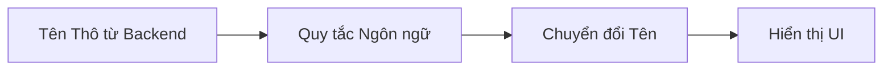
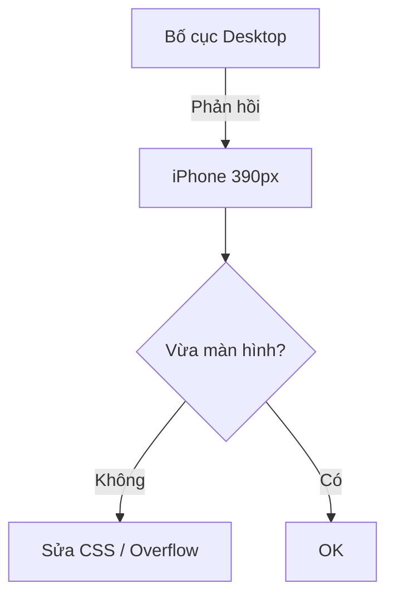

# QA-ST-0001 — Tiêu Chuẩn Kiểm Tra và Xác Minh Nhanh (Bản Phác Thảo)

Tiêu chuẩn này xác định **cách thực hiện các bài kiểm tra nhanh chóng, nhất quán và có thể tái tạo**, đảm bảo rằng mọi giao hàng nội bộ hoặc bên ngoài duy trì mức chất lượng tối thiểu mà DJIN Tech mong đợi.

Nó áp dụng cho:

* Kiểm tra nội bộ do DJIN Members thực hiện
* Kiểm tra QA chính thức
* Xác thực trước khi gửi thứ gì đó cho khách hàng
* Các tình huống tốc độ cao (Chế độ Strict / Lazy)

Mục tiêu là **loại bỏ nhiễu**, **xác định nhanh các lỗi rõ ràng** và **đảm bảo không có gì đáng xấu hổ đến tay khách hàng**.

---

# 1. CÁC ĐẦU RA KHẢ THI

Mỗi lần thực thi QA-ST-0001 phải dẫn đến **một trong hai đầu ra chính thức**.

## **Đầu ra 1 — Tài liệu + Chuyển giao cho người khác**

Sử dụng khi:

* Bạn tìm thấy các vấn đề mà bạn **không nên hoặc không thể** sửa trực tiếp.

Những gì cần cung cấp:

* Danh sách các vấn đề được tìm thấy
* Tham chiếu đến các mục được đánh số trong Tiêu chuẩn này
* Bằng chứng (ảnh chụp màn hình, video, in console)

Các hành động bắt buộc:

1. Tạo **Nhiệm vụ Jira** với mọi thứ được ghi chép **hoặc** tái sử dụng Nhiệm vụ hiện có nếu có thể áp dụng.
2. Chỉ định lại cho Bên Chịu trách nhiệm (thường là di chuyển ngược lại một cột trong Jira).
   * Nếu Bên Chịu trách nhiệm nằm ngoài phạm vi, **chuyển lên Quản lý**.
   * Ví dụ: nhiệm vụ tồn tại, đang ở cột D ("Kiểm tra Vận hành"). Bình luận và di chuyển trở lại cột C ("Cần làm").
   Lưu ý: chữ cái được sử dụng để giải thích các cột vì tên cột thực tế có thể thay đổi theo thời gian/dự án. Nhưng logic là rõ ràng và có thể áp dụng cho bất kỳ dự án nào.
3. Ghi lại trong Slack / bình luận Nhiệm vụ rằng:
   * danh sách kiểm tra đã được thực thi → **[→ Truy cập Danh sách kiểm tra](../../../toolbox/QA-ST-0001/checklist-vi.md)**
   * vấn đề đã được tìm thấy
   * Nhiệm vụ đã được tạo
4. Vào cuối ngày làm việc, đề cập rằng thủ tục này đã được thực hiện.

---

## **Đầu ra 2 — Sửa chữa ngay lập tức + Ghi nhật ký**

Sử dụng khi:

* Bạn tìm thấy các vấn đề **nhỏ**, tầm thường hoặc rõ ràng
* Và đã sửa chúng

Những gì cần cung cấp:

* Danh sách đơn giản về những gì được tìm thấy
* Những gì đã được sửa
* Bằng chứng cuối cùng (ảnh chụp màn hình / video)
* Giao tiếp trong Slack hoặc Nhiệm vụ nói:
  "Danh sách kiểm tra đã thực thi, vấn đề được tìm thấy và sửa chữa."

---

# 2. CHẾ ĐỘ VẬN HÀNH

---

# 2.1 PHẠM VI (THAM SỐ THỰC THI BẮT BUỘC)

Mọi bài kiểm tra được thực thi theo QA-ST-0001 **phải tôn trọng nghiêm ngặt phạm vi được xác định**.

### **Phạm vi Mặc định:**

**Nhiệm vụ hiện tại.** Không có gì ngoài Nhiệm vụ nên được sửa đổi mà không có chỉ thị rõ ràng từ DJIN.

### **Mở rộng Phạm vi (khi được phép):**

Chỉ có thể xảy ra khi DJIN cung cấp **ranh giới rõ ràng**, chẳng hạn như:

* Phạm vi bắt đầu từ đâu;
* Phạm vi kết thúc ở đâu;
* Có thể thay đổi gì;
* Không thể thay đổi **gì**;
* Tác động dự kiến nào được ủy quyền.

### **Trách nhiệm Bắt buộc của DJIN Member / QA:**

Ngay cả khi một cái gì đó **nằm ngoài phạm vi**, nhưng bạn **nhận thấy** rằng:

* nó sai,
* nó bị hỏng,
* nó không nhất quán,
* nó rủi ro,
* hoặc sẽ tạo ra vấn đề trong tương lai,

QA **không thể bỏ qua**.

Trong những trường hợp này, bắt buộc phải bao gồm trong Đầu ra Cuối cùng:

### **Phần bắt buộc trong Đầu ra:**

**"Các mục ngoài phạm vi được xác định nhưng không được sửa chữa"**
Liệt kê:

* vấn đề,
* nó xảy ra ở đâu,
* tham chiếu đến mục của Tiêu chuẩn này,
* tại sao nó không được sửa chữa (ví dụ: phạm vi không được phép),
* khuyến nghị (ví dụ: mở Nhiệm vụ, chuyển đến Kiến trúc, chuyển đến Nhật Bản).

### **Quan trọng:**

QA **không mở rộng phạm vi một mình**.
QA **không sửa mọi thứ nó nhìn thấy**.
Nhưng QA **cũng không bỏ qua** những gì nó nhìn thấy.

Quy tắc này đảm bảo:

* tập trung,
* an toàn,
* minh bạch,
* không có công việc ẩn,
* khả năng dự đoán cho Kiến trúc và Quản lý.

---

# 2. CHẾ ĐỘ VẬN HÀNH

QA-ST-0001 có thể chạy ở hai chế độ, tùy thuộc vào thời gian có sẵn.

## **Chế độ Strict (Hoàn chỉnh)**

* Thực hiện **từng mục một**, không bỏ qua.
* Lặp lại nếu cần thiết.
* Dừng lại khi:

  * Không còn ý nghĩa để lặp lại, hoặc
  * Đạt đến thời gian đã thỏa thuận trước.

## **Chế độ Lazy (Nhanh)**

* Xác định giới hạn thời gian (ví dụ: 30 phút).
* Quét qua tất cả các mục một cách nhanh chóng.
* Chỉ đánh dấu những điều cần thiết.
* Lý tưởng cho các giao hàng trước nhanh chóng.

---

# 3. CÔNG CỤ BẮT BUỘC

## 3.0 Xác thực Bản dịch

Có **hai cách hợp lệ** để xác thực bản dịch:

### **Tùy chọn 1 — Xác thực bởi DJIN Member Bản địa**

* **DJIN Members từ quốc gia/khu vực nơi ngôn ngữ là bản địa** có thể xác thực bản dịch trực tiếp
* Họ **phải** sử dụng DeepL và/hoặc Takoboto như **công cụ hỗ trợ trong trường hợp nghi ngờ**
* Họ không bắt buộc phải xác thực độc quyền qua DeepL/Takoboto, nhưng những công cụ này **phải có sẵn** để tham khảo

### **Tùy chọn 2 — Xác thực qua Công cụ (cho người không phải bản địa)**

Các công cụ sau **phải được mở và sử dụng có ý thức**:

* **DeepL** — Cho bản dịch đầy đủ.
* **Takoboto** — Để kiểm tra từ đơn lẻ.

---

## 3.1 Công thức (Công cụ Tự động hóa và Hỗ trợ qua CLI / AI Agents)

Trước hoặc trong quá trình thực thi QA-ST-0001, **kiểm tra xem có công thức khả dụng** trong kho dự án hoặc tài liệu nội bộ **DJIN-Work** có thể:

* tự động hóa kiểm tra,
* giúp kiểm tra đoạn mã,
* xác thực bản dịch,
* xác định lỗi chính tả,
* thực hiện các bài kiểm tra lặp lại,
* tăng tốc điều hướng và thu thập dữ liệu,
* hoặc phân tích các mẫu UI/UX.

Nếu có công thức áp dụng được:

* Sử dụng chúng theo sự cho phép của dự án của bạn.
* Ghi chép trong đầu ra nếu có công thức nào được sử dụng.
* Nếu công thức tìm thấy điều gì đó tự động, hãy coi nó như bằng chứng.

### ⚠ TODO (chính thức, đang chờ triển khai)

Một **thư mục hoặc kho công thức chính thức** sẽ được thêm vào chứa:

* Lệnh CLI được DJIN phê duyệt,
* Các AI agents chuyên về xem xét UI, mã và mẫu,
* kịch bản kiểm tra,
* hướng dẫn nhất quán và có phiên bản.

Hiện tại:

* Chỉ sử dụng các công thức bạn **có quyền truy cập và được phép**.
* Nếu không có công thức nào khả dụng, **thực hiện mọi thứ thủ công** tập trung vào phạm vi Nhiệm vụ của bạn.
* Không sử dụng các công cụ bên ngoài chưa được phê duyệt.

---

Các công cụ sau **phải được mở và sử dụng có ý thức**:

* **DeepL** — Cho bản dịch đầy đủ.
* **Takoboto** — Để kiểm tra từ đơn lẻ.

Bạn **không nên** sử dụng Google Dịch để xác thực văn bản cuối cùng.

---

# 4. DANH SÁCH KIỂM TRA CHÍNH THỨC (Mục 1 → 11)

# **1 — Môi trường và Thông tin Đăng nhập (Bắt buộc trước khi bắt đầu)**

Trong đầu ra cuối cùng, làm rõ:

* Môi trường được sử dụng:

  * `in-house-preview` (kiểm tra nội bộ)
  * `customer-preview` (kiểm tra với khách hàng)
  * `production`
* Thông tin đăng nhập: email/ID + mật khẩu
* Tên hiển thị trong hệ thống (để kiểm tra hiển thị)

---

# **2 — Bản dịch**

### **Bảng — Đúng vs Sai (Bản dịch và Hiển thị Tên)**

| Trường hợp                   | Sai                 | Đúng                              |
| ---------------------------- | ------------------- | --------------------------------- |
| JP UI — Tên đảo ngược        | Tarō Yamada         | 山田 太郎 (Yamada Tarō)              |
| PT-BR UI — Thứ tự đảo ngược  | Silva João          | João Silva                        |
| EN UI — Tên đầy đủ sai       | Smith John          | John Smith                        |
| Từ đơn được dịch sai         | "Attendance" → 出席する (động từ) | "Attendance" → 出席 (danh từ đúng)  |
| DeepL bị bỏ qua              | Tin nhắn lai PT/EN  | Văn bản đầy đủ được dịch qua DeepL |

---

**Ví dụ trực quan (Mermaid) cho logic hiển thị tên:**

*(Sử dụng tùy chọn — chỉ hỗ trợ trực quan.)*

---

## 2.1 Quy tắc chung

### Cho DJIN Members Bản địa của Ngôn ngữ Đích

* Có thể xác thực bản dịch trực tiếp bằng kiến thức bản địa của họ
* **Phải** sử dụng DeepL và/hoặc Takoboto như **hỗ trợ trong trường hợp nghi ngờ**
* Không bắt buộc phải tuân theo quy trình dưới đây, nhưng công cụ phải có sẵn

### Cho DJIN Members Không Phải Bản địa

* Văn bản đầy đủ → **DeepL** (ngôn ngữ nguồn → tiếng Nhật)
* Từ đơn lẻ:

  1. Tìm từ bằng tiếng Anh (DeepL nếu cần)
  2. Tìm kiếm trong **Takoboto**
  3. Sử dụng **kết quả đầu tiên**

## 2.2 Avatar và hiển thị tên

Thứ tự tên phụ thuộc vào ngôn ngữ UI:

| Ngôn ngữ   | Thứ tự        |
| ---------- | ------------- |
| JP         | Họ → Tên      |
| PT-BR      | Tên → Họ      |
| EN         | Tên → Họ      |
| KR         | Họ → Tên      |
| CN         | Họ → Tên      |
| Vietnamese | Họ → Tên      |
| Tagalog    | Tên → Họ      |

**Tên đệm** được coi như một phần của họ, trừ khi hệ thống tách rõ ràng 3 trường.

Danh sách kiểm tra nhanh:

* Tên được hiển thị đúng?
* Avatar đúng?
* Tên không bị đảo ngược?

---

# **3 — Kiểm tra chính tả (Mã + UI)**

Xác minh:

* Lỗi chính tả trong mã
* Lỗi chính tả trong backend
* Lỗi chính tả trong UI

Quy tắc:

* Bản dịch x → tiếng Nhật → luôn xác thực trong DeepL
* Từ đơn lẻ → Takoboto
* Nếu có gì không khớp → **báo cáo**

---

# **4 — Xác minh Dữ liệu Cơ bản**

* Không có placeholder
* Không có gì xúc phạm
* Văn bản tối thiểu mạch lạc
* Tên hư cấu phù hợp:

  * JP: Yamada Tarō
  * PT: João Silva

---

# **5 — Xác minh Bản dịch Giao diện**

* Các nút và văn bản chính được dịch đúng
* Không có gì bằng pt-BR nơi nó nên bằng tiếng Nhật
* Không thiếu gì bằng tiếng Anh

Thứ tự tên theo ngôn ngữ (quy tắc từ mục 2)

---

# **6 — Rò rỉ**

Tìm kiếm những thứ như:

* UUID
* ID nội bộ
* stacktraces
* undefined / null / [object Object]
* lỗi API thô
* thông điệp kỹ thuật chưa được dịch

Nếu tìm thấy → chặn giao hàng.

---

# **7 — Bố cục**

### **Bảng — Đúng vs Sai (Bố cục và Khả năng Phản hồi)**

| Trường hợp                  | Sai                    | Đúng                            |
| --------------------------- | ---------------------- | ------------------------------- |
| Cuộn ngang không mong muốn  | Màn hình dịch chuyển ngang | Bố cục không tràn bên           |
| Nút bị cắt                  | Một nửa ẩn             | 100% hiển thị ở mọi chiều rộng  |
| Văn bản tràn container      | Tiêu đề vượt qua biên  | Tiêu đề có wrap phù hợp         |
| Danh sách không có padding  | Các mục dính vào nhau  | Padding đồng nhất               |

---

### **Ví dụ trực quan Mermaid — Khả năng Phản hồi**

---

Xác minh luồng chính trong:

* Desktop
* Chiều rộng iPhone (~390px)

Kiểm tra:

* Không có gì tràn container
* Các nút có thể nhấp
* Danh sách tải
* Không có cuộn ngang

---

# **8 — Luồng Chính**

Cho **mỗi màn hình**:

* Nhấp vào CTA chính
* Tạo → Chỉnh sửa → Xóa 1 bản ghi

Xác thực nếu:

* Không đóng băng
* Không phá vỡ bố cục
* Điều hướng hoạt động
* Không có cảnh báo xấu

---

# **9 — Chính tả và Tin nhắn**

Câu hỏi vàng:
"Tôi có xấu hổ khi cho khách hàng xem câu này không?"

Nếu có → sửa hoặc báo cáo.

---

# **10 — Màu sắc và Thương hiệu**

Kiểm tra nhanh:

* Màu ngoài tiêu chuẩn
* Các thành phần Vuetify thô
* Độ tương phản thấp

Không có tái cấu trúc sâu — chỉ ngoại hình chấp nhận được.

---

# **11 — Bằng chứng (Ảnh chụp màn hình / Video)**

### **Bảng — Đúng vs Sai (Bằng chứng)**

| Trường hợp            | Sai                      | Đúng                                |
| --------------------- | ------------------------ | ----------------------------------- |
| Ảnh chụp màn hình bị cắt | Một phần giao diện thiếu | Toàn màn hình với tiêu điểm rõ ràng |
| Video không đầy đủ    | Chỉ mở màn hình          | Hiển thị CTA → Tạo → Chỉnh sửa → Xóa |
| Không có ngữ cảnh     | Tệp lỏng lẻo            | Tên + môi trường + người dùng       |

---

# ✔ DANH SÁCH KIỂM TRA

**[→ Truy cập Danh sách Kiểm tra](../../../toolbox/QA-ST-0001/checklist-vi.md)**

Sử dụng danh sách kiểm tra trên cho các lần thực thi QA-ST-0001 nhanh chóng và khách quan.

---

Trước khi giao hàng:

* 1 ảnh chụp màn hình của mỗi màn hình
* 1 video ngắn của luồng chính

Câu hỏi cuối cùng:

> **Tôi có thể cho khách hàng xem điều này mà không sợ hãi không?**

Nếu câu trả lời là "không", hãy sửa nó.

---

# KẾT THÚC

Tiêu chuẩn này xác định **chất lượng tối thiểu chấp nhận được** cho bất kỳ giao hàng nào.
Nó là bắt buộc đối với tất cả DJIN Members và đóng vai trò như một chiếc ô nhất quán ở tốc độ cao.

Thực thi QA-ST-0001 trước bất kỳ giao hàng nào làm giảm nhiễu, tăng khả năng dự đoán và bảo vệ danh tiếng kỹ thuật của DJIN Tech.
